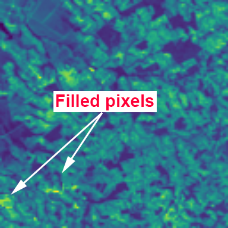

# louis_misr
This repository provides a solution to the 
[PROBA-V Satellite Image Super Resolution challenge](https://kelvins.esa.int/proba-v-super-resolution) 
using MISR (Multi Image Super Resolution). 

This README will detail how to use this repo, key implementation explanations and results. 

## Problem Statement
Proba-V refers to the ESA's (European Space Agency) Earth observation satellite, designed to map land cover 
and vegetation grown across the Earth. The satellite is able to capture low resolution images at 300m and high 
resolution at 100m, however it captures the high resolution images at a lower frequency; roughly every 5 days.

The aim of the challenge is to construct high resolution images by fusing the more frequent low resolution images with 
the desired result giving a higher quality image than simple **bicubic resizing**. 

One approach to this is to use some fusion algorithm/network to create one LR image out of the given LR images in the 
set and train a SISR (Single Image Super Resolution) network to produce the output. Whilst a valid approach, 
it does not exploit the wealth of spacial and inherent information that a multi image approach provides, and is also 
subject to reconstructing undesirable objects, for example clouds. 

The following sections detail how I expanded upon a state of the art SISR architecture to provide an MISR solution to 
the challenge. 

## Proposed Architecture
The architecture used for this solution is a modified version of a state-of-the-art SISR network, 
[DCSCN](https://github.com/jiny2001/dcscn-super-resolution). 
The architecture extends DCSCN by allowing a dynamic number of input images to construct the final HR image.

### Architecture
The diagram below is a summary of the proposed architecture. 
This is the original design from the DCSCN repo with the modifications shown in the RED box.  


* The Louis MISR constructs N branches of the **"feature extraction network"**, and provides all outputs to the
first **"concatenate"** layer.
* After the first **"concatenate"** layer, the original **"reconstruction network"** 
is utilised to build the final output image. 
* The first image from the choices of LR images is used for the "bicubic up-sampling". 
During training, this image is randomly chosen each iteration.
* I also added a handy new MISR dataset factory, as I felt the original code for handling datasets was a little
 clunky. Check out [dataset_factory_misr.py](submodules/dcscn_super_resolution/helper/dataset_factory_misr.py) 

You can observe my additions to the DCSCN code by checking out the commit history of my fork of the repo 
[here](https://github.com/louisquinn/dcscn_super_resolution/commits/7a5b24673f927b3eb9ad20b680fa04bb8a34d9d8).
My commits are under the **louisquinn** and **Louis Quinn** accounts.

## Repo Installation
### Clone the repo and install submodules
```bash
git clone https://github.com/louisquinn/louis_misr.git
cd louis_misr

# You may need to provide git login credentials here...
git submodule init
git submodule update
```

Below is a breakdown of the submodules used:
* **dcscn_super_resolution:** My fork of the DCSCN Super Resolution Project
* **cnn_registration:** My fork of an image registration framework using CNNs
* **probav:** A repo of useful functions created for this challenge

### Installing Packages
I highly recommend using a fresh Python VM and installing all packages into it. Do so in the following way:
```bash
# Install Python3 and pip
sudo apt-get update
sudo apt-get install python3-dev python3-pip

# Install virtualenv with pip
sudo pip3 install -U virtualenv

# Create the virtual env at "target_path" and activate it
virtualenv --system-site-packages -p python3 target_vm_path
source target_vm_path/bin/activate

# Upgrade pip, and install the required Python modules
pip3 install --upgrade pip
pip3 install -r requirements.txt
```
`requirements.txt` will install Tensorflow v1.12.0.

## Data pre-processing
This section details the considerations and implementation of data pre-processing.

### Images and Corresponding Quality Maps
Each image (LR and HR) comes with a "quality map" provided by the challenge moderators. 
The quality maps give information of which pixels of the image is obscructed by objects like clouds.

#### Filling Obscured Pixels
We can utilise the multiple views of each scene to fill the obscured pixels with the mean, 
or median of all the scene's LR images (aggregated image). This process is detailed below:

Aggregate Image of LR images | Quality Map | 
------------ | -------------  
 | 

Original Image | Final Result
------------- | ------------- 
 | 

#### Image Registration 
**NOTE: This is not fully implemented, however it is available**

Reference Image | Registered Image
------------ | -------------
 | 

## Repo Usage
**Ensure your Python VM is activated! :-)**
```bash
source target_vm_path/bin/activate
```

### Data pre-processing
**Pre-process the dataset**
```bash
cd louis_misr
python preprocess_probav.py \ 
    --dataset_path=<path to the probav top-level directory> \ 
    --output_path=<path to dump the output>
```

You can set the `--do_registration` argument for image registration.

**Make a symlink from your preprocessed dataset to the module's data folder**
```bash
cd louis_misr/submodules/dcscn_super_resolution/data
ln -s <path to output of preprocess script> probav
```

### Training
```bash
# Launch the training
cd louis_misr/submodules/dcscn_super_resolution
python train.py --dataset=probav
```

#### Important Params
Param Name | Default | Explanation
------------ | ------------- | -------------
num_input_images | 9 | This is the number of LR inputs to the model. This also dictates how many feature extraction modules are generated. If you are running out of GPU memory you can lower this.
scale | 3 | The input to output resolution scale. 3 for PROBA-V challenge.
layers | 12 | The number of layers for each feature extraction module. Reduce to **6** if you run out of GPU memory. 
filters | 196 | Number of filters in each feature extraction module. Reduce to **98** if you run out of GPU memory.
batch_num | 1 | The batch size. I was able to use a batch of **2** on my **Titan RTX**.

### Evaluation
The module will perform evaluation in a new thread after each epoch. 
Interesting plots and image results can be viewed in Tensorboard (see below).

#### Tensorboard
You can track various model training param losses and images with Tensorboard. 
Launch Tensorboard in the following way:
```bash
# Ensure your Python VM is activated
source target_vm_path/bin/activate
tensorboard --logdir=<path to louis_misr>/submodules/dcscn_super_resolution/tf_log
```

The below image is an example of how you can observe the model's output over training.


### Exporting the graph for inference
```bash
cd louis_misr/submodules/dcscn_super_resolution/helper
python custom_freeze_graph.py \
    --model_dir=<path to checkpoints> \
    --output_node_names=output
```

The `--model_dir` param can be set to: `dcscn_super_resolution/models`.

The output graph will be saved to the same path as `--model_dir`.

## Results
Some example results on the validation set are shown below.

### Visual Evaluation
You can run inference on any of the images in the database as follows:
```bash
cd louis_misr
python run_misr.py \
    --db_path=<path to probav dataset or specific scene> \ 
    --num_inputs=9 \ (or the number you used for training.)
    --model_path=<path to frozen graph>
```

The script will: cycle through the database, perform inference, display the results in the following way:

**Grid and concat image here**

## Summary and Improvements
This was a great little side project to work on, it was quite a departure from my current work. 
Researching for this project, I learnt quite a bit about Super Image Resolution and what 
is capable with various deep learning architectures. I also discovered, and got inspiration for new 
approaches to solving some of the upcoming R&D projects in my current work. 

If I had more time to work on this, I would have loved to implement a more refined solution. 
Some of these improvements are listed in the next section below.

### Improvements, given more time
* **Training Data Augmentation:** Augmentation is important to improving a model's robustness. In my current work
I apply it to every training job I do. I usually use the popular **imgaug** library, or implement my own methods in 
Tensorflow. Augmentors like brightness, contrast, random noise etc would be beneficial to MISR.
* **Proper cPSNR Calculation:** I believe there is an error either in my interpretation of the scoring procedure, or in 
the tools I was using to score. It is evident from observing the network's output that the MISR images are of higher 
quality than bicubic resizing, however to provide a complete solution this metric needs to be calculated properly. 
* **Image Registration:** Registration will improve results, however I was not able to implement this properly in the time
frame I allotted to myself. Ideally, this would happen internally in the network, as was done by the competition's winners.

### Challenges
The biggest challenge was finding a decently implemented SISR starting point and working out how to extend it to an MISR problem. 

Whilst the DCSCN work is impressive, the code base is not especially implemented well and isn't scalable, so I changed it to be 
more dynamic and flexible, so that it provides a nice framework for other MISR problems. It can also be used for SISR applications, 
by setting the `num_input_images` to **1**.

